# Resume-Parser


## 1. Create NER Model using scapy

```
using NER Model.ipynb
```

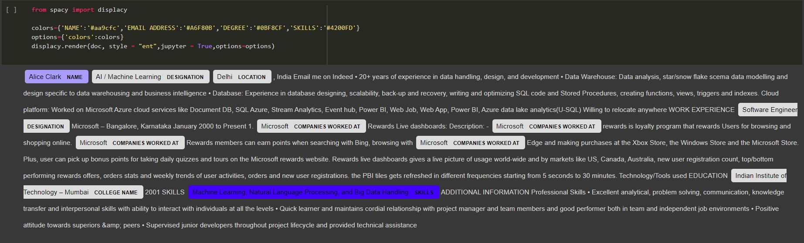

## 2. Download and compress this model in tar.gz file

## 3. Now upload this model in S3 bucket on AWS

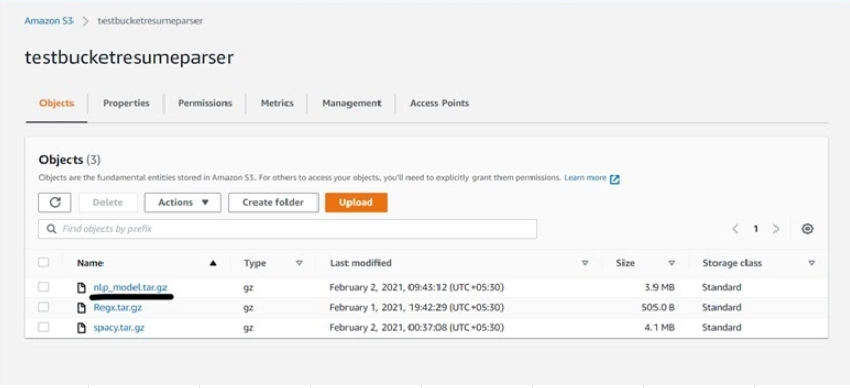

## 4. Now  create a ECR repository on aws  where we are going to push our docker image

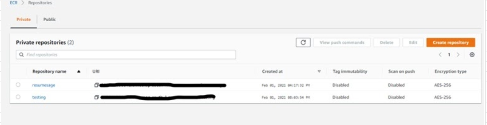

## 5. Go to aws ECR repository and create a  repository

## 6. Now we create our docker image out of our docker container  
```
docker build -t <image-name>  
```

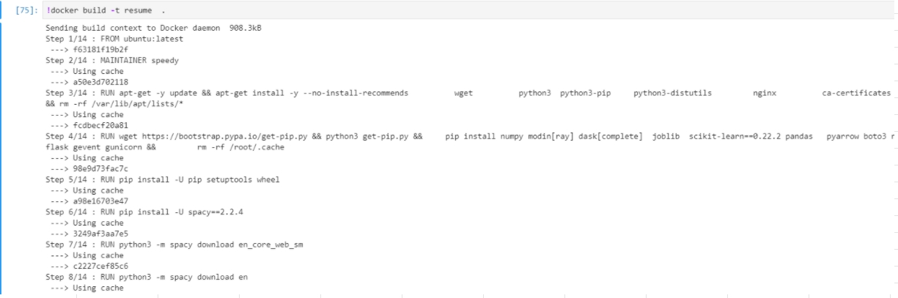

## Now after we have build our image we tag it with our ecr repository we just created 
```
docker tag <image-name>   <repository-name>:<image>
``` 

## After tagging our image we push it to the ecr repository . 
```
docker push  repository-name:<image>
```

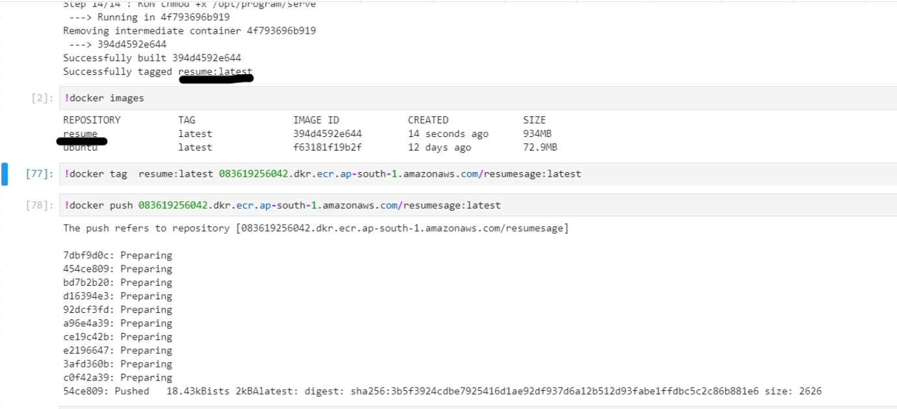

## Now that we can see the image is pushed to check you can go to your ecr repository and in the repository you should see your image

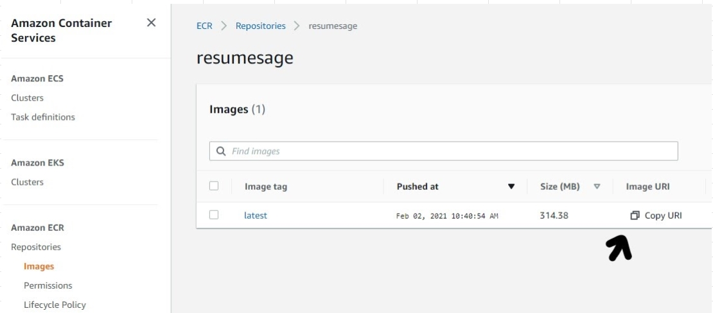

## Copy this uri because we will use it when creating model. 

## Go to Aws sage  under real time infernece ->  go to model  -> and create a new model  

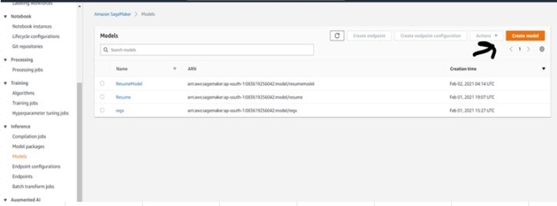

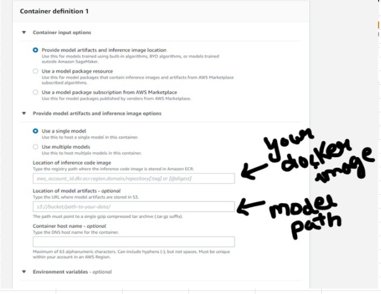

## Now that we have model create a endpoint configuration 

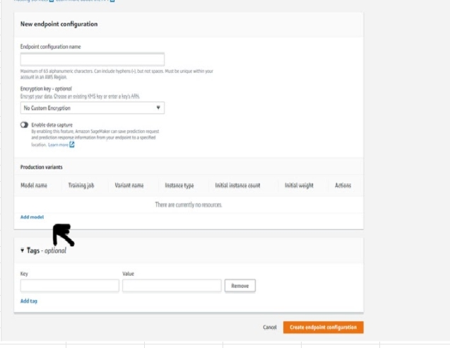

## Now create a endpoint and use the endpoint config we just created .  

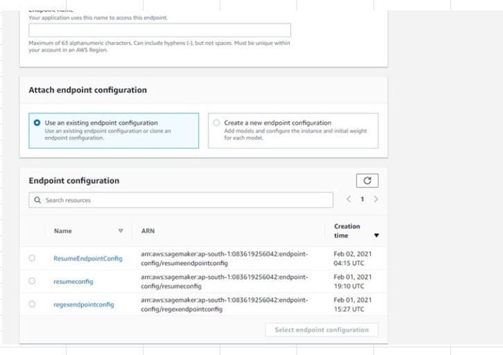

## Now we can just a simple python script to invoke this endpoint and see if our prediction function works .

```
import json 
import boto3
import sagemaker
from sagemaker import get_execution_role
import fitz

sagemaker=boto3.client('runtime.sagemaker')


fname = 'Smith Resume.pdf'
doc = fitz.open(fname)
text = ""
for page in doc:
    text = text + str(page.getText())

tx = " ".join(text.split('\n'))
    

inputt={
    "input":
    {
        "exp1":"Pradeep Kumar Security Analyst in Infosys - Career Contour  Hyderabad, Telangana, Telangana - Email me on Indeed: indeed.com/r/Pradeep- Kumar/96485546eadd9488  WORK EXPERIENCE  Security Analyst in Infosys  Career Contour -  March 2015 to Present  Security incident and event management (SIEM) is the process of identifying, monitoring and analysing security events or incidents within a real-time IT environment. It provides centralized view of the security scenario of an IT infrastructure  EDUCATION  B- Tech  Jawaharlal Nehru Technological University -  Hyderabad, Telangana  SKILLS  Splunk, Network Security, Arc sight (2 years), SIEM (2 years), McAfee ESM (1 year)  ADDITIONAL INFORMATION  Technologies: McAfee SIEM, Arc sight, HP Service manager. Description: Security incident and event management (SIEM) is the process of identifying, monitoring and analysing security events or incidents within a real-time IT environment. It provides centralized view of the security scenario of an IT infrastructure. Roles and Responsibilities: • Have Experience in device integration, alarm creation in ESM. • Having Experience on analysing FIREWALL events. • Checking health status for all devices in ESM. • Working in Offshore SOC team, Monitoring of SOC events, detecting and preventing the Intrusion attempts. • Hands-on experience monitoring the SIEM tool. • Provide level 2 supports to manage SIEM components. • Creating reports as per client requirement. • Analysing daily, weekly and monthly reports. • Creating case for the suspicious issue and forwarding it to Onsite SOC team for further investigation. • Monitoring the events on SIEM tool. • Creating the tickets in ticketing tool.  https://www.indeed.com/r/Pradeep-Kumar/96485546eadd9488?isid=rex-download&ikw=download-top&co=IN https://www.indeed.com/r/Pradeep-Kumar/96485546eadd9488?isid=rex-download&ikw=download-top&co=IN   • Finding false positive, fine tuning and escalating Security events."

    }
}


payload=json.dumps(inputt)
ENDPOINT_NAME='resumeEndpoint18'
response=sagemaker.invoke_endpoint(EndpointName=ENDPOINT_NAME,
                                  ContentType='application/json',
                                  Body=payload)
result=json.loads(response['Body'].read().decode())

print(json.dumps(result,indent=2))
```

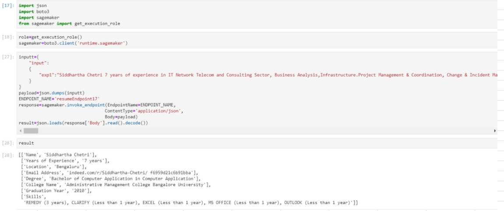
